# Welcome to Covid19 Data Analysis Notebook
------------------------------------------

### Let's Import the modules 


```python
import pandas as pd 
import numpy as np 
import seaborn as sns
import matplotlib.pyplot as plt 
print('Modules are imported.')
```

    Modules are imported.


## Task 2 

### Task 2.1: importing covid19 dataset
importing "Covid19_Confirmed_dataset.csv" from "./Dataset" folder. 


```python
corona_dataset_csv=pd.read_csv("Datasets/covid19_Confirmed_dataset.csv")
corona_dataset_csv.head(10) #To check first 10 rows of dataset
```


<div>
<style scoped>
    .dataframe tbody tr th:only-of-type {
        vertical-align: middle;
    }

    .dataframe tbody tr th {
        vertical-align: top;
    }

    .dataframe thead th {
        text-align: right;
    }
</style>
<table border="1" class="dataframe">
  <thead>
    <tr style="text-align: right;">
      <th></th>
      <th>Province/State</th>
      <th>Country/Region</th>
      <th>Lat</th>
      <th>Long</th>
      <th>1/22/20</th>
      <th>1/23/20</th>
      <th>1/24/20</th>
      <th>1/25/20</th>
      <th>1/26/20</th>
      <th>1/27/20</th>
      <th>...</th>
      <th>4/21/20</th>
      <th>4/22/20</th>
      <th>4/23/20</th>
      <th>4/24/20</th>
      <th>4/25/20</th>
      <th>4/26/20</th>
      <th>4/27/20</th>
      <th>4/28/20</th>
      <th>4/29/20</th>
      <th>4/30/20</th>
    </tr>
  </thead>
  <tbody>
    <tr>
      <th>0</th>
      <td>NaN</td>
      <td>Afghanistan</td>
      <td>33.0000</td>
      <td>65.0000</td>
      <td>0</td>
      <td>0</td>
      <td>0</td>
      <td>0</td>
      <td>0</td>
      <td>0</td>
      <td>...</td>
      <td>1092</td>
      <td>1176</td>
      <td>1279</td>
      <td>1351</td>
      <td>1463</td>
      <td>1531</td>
      <td>1703</td>
      <td>1828</td>
      <td>1939</td>
      <td>2171</td>
    </tr>
    <tr>
      <th>1</th>
      <td>NaN</td>
      <td>Albania</td>
      <td>41.1533</td>
      <td>20.1683</td>
      <td>0</td>
      <td>0</td>
      <td>0</td>
      <td>0</td>
      <td>0</td>
      <td>0</td>
      <td>...</td>
      <td>609</td>
      <td>634</td>
      <td>663</td>
      <td>678</td>
      <td>712</td>
      <td>726</td>
      <td>736</td>
      <td>750</td>
      <td>766</td>
      <td>773</td>
    </tr>
    <tr>
      <th>2</th>
      <td>NaN</td>
      <td>Algeria</td>
      <td>28.0339</td>
      <td>1.6596</td>
      <td>0</td>
      <td>0</td>
      <td>0</td>
      <td>0</td>
      <td>0</td>
      <td>0</td>
      <td>...</td>
      <td>2811</td>
      <td>2910</td>
      <td>3007</td>
      <td>3127</td>
      <td>3256</td>
      <td>3382</td>
      <td>3517</td>
      <td>3649</td>
      <td>3848</td>
      <td>4006</td>
    </tr>
    <tr>
      <th>3</th>
      <td>NaN</td>
      <td>Andorra</td>
      <td>42.5063</td>
      <td>1.5218</td>
      <td>0</td>
      <td>0</td>
      <td>0</td>
      <td>0</td>
      <td>0</td>
      <td>0</td>
      <td>...</td>
      <td>717</td>
      <td>723</td>
      <td>723</td>
      <td>731</td>
      <td>738</td>
      <td>738</td>
      <td>743</td>
      <td>743</td>
      <td>743</td>
      <td>745</td>
    </tr>
    <tr>
      <th>4</th>
      <td>NaN</td>
      <td>Angola</td>
      <td>-11.2027</td>
      <td>17.8739</td>
      <td>0</td>
      <td>0</td>
      <td>0</td>
      <td>0</td>
      <td>0</td>
      <td>0</td>
      <td>...</td>
      <td>24</td>
      <td>25</td>
      <td>25</td>
      <td>25</td>
      <td>25</td>
      <td>26</td>
      <td>27</td>
      <td>27</td>
      <td>27</td>
      <td>27</td>
    </tr>
    <tr>
      <th>5</th>
      <td>NaN</td>
      <td>Antigua and Barbuda</td>
      <td>17.0608</td>
      <td>-61.7964</td>
      <td>0</td>
      <td>0</td>
      <td>0</td>
      <td>0</td>
      <td>0</td>
      <td>0</td>
      <td>...</td>
      <td>23</td>
      <td>24</td>
      <td>24</td>
      <td>24</td>
      <td>24</td>
      <td>24</td>
      <td>24</td>
      <td>24</td>
      <td>24</td>
      <td>24</td>
    </tr>
    <tr>
      <th>6</th>
      <td>NaN</td>
      <td>Argentina</td>
      <td>-38.4161</td>
      <td>-63.6167</td>
      <td>0</td>
      <td>0</td>
      <td>0</td>
      <td>0</td>
      <td>0</td>
      <td>0</td>
      <td>...</td>
      <td>3031</td>
      <td>3144</td>
      <td>3435</td>
      <td>3607</td>
      <td>3780</td>
      <td>3892</td>
      <td>4003</td>
      <td>4127</td>
      <td>4285</td>
      <td>4428</td>
    </tr>
    <tr>
      <th>7</th>
      <td>NaN</td>
      <td>Armenia</td>
      <td>40.0691</td>
      <td>45.0382</td>
      <td>0</td>
      <td>0</td>
      <td>0</td>
      <td>0</td>
      <td>0</td>
      <td>0</td>
      <td>...</td>
      <td>1401</td>
      <td>1473</td>
      <td>1523</td>
      <td>1596</td>
      <td>1677</td>
      <td>1746</td>
      <td>1808</td>
      <td>1867</td>
      <td>1932</td>
      <td>2066</td>
    </tr>
    <tr>
      <th>8</th>
      <td>Australian Capital Territory</td>
      <td>Australia</td>
      <td>-35.4735</td>
      <td>149.0124</td>
      <td>0</td>
      <td>0</td>
      <td>0</td>
      <td>0</td>
      <td>0</td>
      <td>0</td>
      <td>...</td>
      <td>104</td>
      <td>104</td>
      <td>104</td>
      <td>105</td>
      <td>106</td>
      <td>106</td>
      <td>106</td>
      <td>106</td>
      <td>106</td>
      <td>106</td>
    </tr>
    <tr>
      <th>9</th>
      <td>New South Wales</td>
      <td>Australia</td>
      <td>-33.8688</td>
      <td>151.2093</td>
      <td>0</td>
      <td>0</td>
      <td>0</td>
      <td>0</td>
      <td>3</td>
      <td>4</td>
      <td>...</td>
      <td>2969</td>
      <td>2971</td>
      <td>2976</td>
      <td>2982</td>
      <td>2994</td>
      <td>3002</td>
      <td>3004</td>
      <td>3016</td>
      <td>3016</td>
      <td>3025</td>
    </tr>
  </tbody>
</table>
<p>10 rows × 104 columns</p>
</div>


#### Let's check the shape of the dataframe


```python
corona_dataset_csv.shape
```


    (266, 104)


### Task 2.2: Delete useless columns


```python
df = corona_dataset_csv.drop(["Lat","Long"],axis=1,inplace=True)
```

### Task 2.3: Aggregating the rows by the country


```python
corona_dataset_aggregated=corona_dataset_csv.groupby("Country/Region").sum()
```


```python
corona_dataset_aggregated.head()
```


<div>
<style scoped>
    .dataframe tbody tr th:only-of-type {
        vertical-align: middle;
    }

    .dataframe tbody tr th {
        vertical-align: top;
    }

    .dataframe thead th {
        text-align: right;
    }
</style>
<table border="1" class="dataframe">
  <thead>
    <tr style="text-align: right;">
      <th></th>
      <th>1/22/20</th>
      <th>1/23/20</th>
      <th>1/24/20</th>
      <th>1/25/20</th>
      <th>1/26/20</th>
      <th>1/27/20</th>
      <th>1/28/20</th>
      <th>1/29/20</th>
      <th>1/30/20</th>
      <th>1/31/20</th>
      <th>...</th>
      <th>4/21/20</th>
      <th>4/22/20</th>
      <th>4/23/20</th>
      <th>4/24/20</th>
      <th>4/25/20</th>
      <th>4/26/20</th>
      <th>4/27/20</th>
      <th>4/28/20</th>
      <th>4/29/20</th>
      <th>4/30/20</th>
    </tr>
    <tr>
      <th>Country/Region</th>
      <th></th>
      <th></th>
      <th></th>
      <th></th>
      <th></th>
      <th></th>
      <th></th>
      <th></th>
      <th></th>
      <th></th>
      <th></th>
      <th></th>
      <th></th>
      <th></th>
      <th></th>
      <th></th>
      <th></th>
      <th></th>
      <th></th>
      <th></th>
      <th></th>
    </tr>
  </thead>
  <tbody>
    <tr>
      <th>Afghanistan</th>
      <td>0</td>
      <td>0</td>
      <td>0</td>
      <td>0</td>
      <td>0</td>
      <td>0</td>
      <td>0</td>
      <td>0</td>
      <td>0</td>
      <td>0</td>
      <td>...</td>
      <td>1092</td>
      <td>1176</td>
      <td>1279</td>
      <td>1351</td>
      <td>1463</td>
      <td>1531</td>
      <td>1703</td>
      <td>1828</td>
      <td>1939</td>
      <td>2171</td>
    </tr>
    <tr>
      <th>Albania</th>
      <td>0</td>
      <td>0</td>
      <td>0</td>
      <td>0</td>
      <td>0</td>
      <td>0</td>
      <td>0</td>
      <td>0</td>
      <td>0</td>
      <td>0</td>
      <td>...</td>
      <td>609</td>
      <td>634</td>
      <td>663</td>
      <td>678</td>
      <td>712</td>
      <td>726</td>
      <td>736</td>
      <td>750</td>
      <td>766</td>
      <td>773</td>
    </tr>
    <tr>
      <th>Algeria</th>
      <td>0</td>
      <td>0</td>
      <td>0</td>
      <td>0</td>
      <td>0</td>
      <td>0</td>
      <td>0</td>
      <td>0</td>
      <td>0</td>
      <td>0</td>
      <td>...</td>
      <td>2811</td>
      <td>2910</td>
      <td>3007</td>
      <td>3127</td>
      <td>3256</td>
      <td>3382</td>
      <td>3517</td>
      <td>3649</td>
      <td>3848</td>
      <td>4006</td>
    </tr>
    <tr>
      <th>Andorra</th>
      <td>0</td>
      <td>0</td>
      <td>0</td>
      <td>0</td>
      <td>0</td>
      <td>0</td>
      <td>0</td>
      <td>0</td>
      <td>0</td>
      <td>0</td>
      <td>...</td>
      <td>717</td>
      <td>723</td>
      <td>723</td>
      <td>731</td>
      <td>738</td>
      <td>738</td>
      <td>743</td>
      <td>743</td>
      <td>743</td>
      <td>745</td>
    </tr>
    <tr>
      <th>Angola</th>
      <td>0</td>
      <td>0</td>
      <td>0</td>
      <td>0</td>
      <td>0</td>
      <td>0</td>
      <td>0</td>
      <td>0</td>
      <td>0</td>
      <td>0</td>
      <td>...</td>
      <td>24</td>
      <td>25</td>
      <td>25</td>
      <td>25</td>
      <td>25</td>
      <td>26</td>
      <td>27</td>
      <td>27</td>
      <td>27</td>
      <td>27</td>
    </tr>
  </tbody>
</table>
<p>5 rows × 100 columns</p>
</div>


```python
corona_dataset_aggregated.shape
```


    (187, 100)


### Task 2.4: Visualizing data related to a country for example India
visualization always helps for better understanding of our data.


```python
corona_dataset_aggregated.loc["India"].plot()
plt.legend()
```

    /usr/local/lib/python3.8/dist-packages/pandas/plotting/_matplotlib/core.py:1235: UserWarning: FixedFormatter should only be used together with FixedLocator
      ax.set_xticklabels(xticklabels)


    <matplotlib.legend.Legend at 0x7faa18596370>


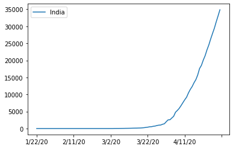


### Task3: Calculating a good measure 
we need to find a good measure reperestend as a number, describing the spread of the virus in a country. 


```python
corona_dataset_aggregated.loc['India'].plot()
```

    /usr/local/lib/python3.8/dist-packages/pandas/plotting/_matplotlib/core.py:1235: UserWarning: FixedFormatter should only be used together with FixedLocator
      ax.set_xticklabels(xticklabels)


    <AxesSubplot:>


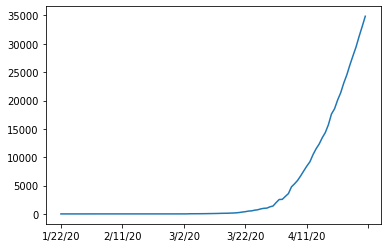


```python
corona_dataset_aggregated.loc["India"][:3].plot()
```

    /usr/local/lib/python3.8/dist-packages/pandas/plotting/_matplotlib/core.py:1235: UserWarning: FixedFormatter should only be used together with FixedLocator
      ax.set_xticklabels(xticklabels)


    <AxesSubplot:>


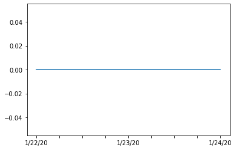


### task 3.1: Calculating the first derivative of the curve


```python
corona_dataset_aggregated.loc["India"].diff().plot().legend()
```

    /usr/local/lib/python3.8/dist-packages/pandas/plotting/_matplotlib/core.py:1235: UserWarning: FixedFormatter should only be used together with FixedLocator
      ax.set_xticklabels(xticklabels)


    <matplotlib.legend.Legend at 0x7faa18442f40>


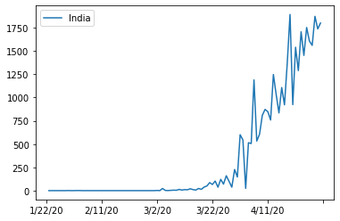


### task 3.2: find maximum infection rate for India , Italy and China


```python
corona_dataset_aggregated.loc["India"].diff().max()
```


    1893.0


```python
corona_dataset_aggregated.loc["Italy"].diff().max()
```


    6557.0


```python
corona_dataset_aggregated.loc["China"].diff().max()
```


    15136.0


### Task 3.3: find maximum infection rate for all of the countries. 


```python
countries = list(corona_dataset_aggregated.index)
max_infection_rates=[]
for i in countries:
    max_infection_rates.append(corona_dataset_aggregated.loc[i].diff().max())
corona_dataset_aggregated["max_infection_rate"]=max_infection_rates
```


```python
corona_dataset_aggregated.head()
```


<div>
<style scoped>
    .dataframe tbody tr th:only-of-type {
        vertical-align: middle;
    }

    .dataframe tbody tr th {
        vertical-align: top;
    }

    .dataframe thead th {
        text-align: right;
    }
</style>
<table border="1" class="dataframe">
  <thead>
    <tr style="text-align: right;">
      <th></th>
      <th>1/22/20</th>
      <th>1/23/20</th>
      <th>1/24/20</th>
      <th>1/25/20</th>
      <th>1/26/20</th>
      <th>1/27/20</th>
      <th>1/28/20</th>
      <th>1/29/20</th>
      <th>1/30/20</th>
      <th>1/31/20</th>
      <th>...</th>
      <th>4/22/20</th>
      <th>4/23/20</th>
      <th>4/24/20</th>
      <th>4/25/20</th>
      <th>4/26/20</th>
      <th>4/27/20</th>
      <th>4/28/20</th>
      <th>4/29/20</th>
      <th>4/30/20</th>
      <th>max_infection_rate</th>
    </tr>
    <tr>
      <th>Country/Region</th>
      <th></th>
      <th></th>
      <th></th>
      <th></th>
      <th></th>
      <th></th>
      <th></th>
      <th></th>
      <th></th>
      <th></th>
      <th></th>
      <th></th>
      <th></th>
      <th></th>
      <th></th>
      <th></th>
      <th></th>
      <th></th>
      <th></th>
      <th></th>
      <th></th>
    </tr>
  </thead>
  <tbody>
    <tr>
      <th>Afghanistan</th>
      <td>0</td>
      <td>0</td>
      <td>0</td>
      <td>0</td>
      <td>0</td>
      <td>0</td>
      <td>0</td>
      <td>0</td>
      <td>0</td>
      <td>0</td>
      <td>...</td>
      <td>1176</td>
      <td>1279</td>
      <td>1351</td>
      <td>1463</td>
      <td>1531</td>
      <td>1703</td>
      <td>1828</td>
      <td>1939</td>
      <td>2171</td>
      <td>232.0</td>
    </tr>
    <tr>
      <th>Albania</th>
      <td>0</td>
      <td>0</td>
      <td>0</td>
      <td>0</td>
      <td>0</td>
      <td>0</td>
      <td>0</td>
      <td>0</td>
      <td>0</td>
      <td>0</td>
      <td>...</td>
      <td>634</td>
      <td>663</td>
      <td>678</td>
      <td>712</td>
      <td>726</td>
      <td>736</td>
      <td>750</td>
      <td>766</td>
      <td>773</td>
      <td>34.0</td>
    </tr>
    <tr>
      <th>Algeria</th>
      <td>0</td>
      <td>0</td>
      <td>0</td>
      <td>0</td>
      <td>0</td>
      <td>0</td>
      <td>0</td>
      <td>0</td>
      <td>0</td>
      <td>0</td>
      <td>...</td>
      <td>2910</td>
      <td>3007</td>
      <td>3127</td>
      <td>3256</td>
      <td>3382</td>
      <td>3517</td>
      <td>3649</td>
      <td>3848</td>
      <td>4006</td>
      <td>199.0</td>
    </tr>
    <tr>
      <th>Andorra</th>
      <td>0</td>
      <td>0</td>
      <td>0</td>
      <td>0</td>
      <td>0</td>
      <td>0</td>
      <td>0</td>
      <td>0</td>
      <td>0</td>
      <td>0</td>
      <td>...</td>
      <td>723</td>
      <td>723</td>
      <td>731</td>
      <td>738</td>
      <td>738</td>
      <td>743</td>
      <td>743</td>
      <td>743</td>
      <td>745</td>
      <td>43.0</td>
    </tr>
    <tr>
      <th>Angola</th>
      <td>0</td>
      <td>0</td>
      <td>0</td>
      <td>0</td>
      <td>0</td>
      <td>0</td>
      <td>0</td>
      <td>0</td>
      <td>0</td>
      <td>0</td>
      <td>...</td>
      <td>25</td>
      <td>25</td>
      <td>25</td>
      <td>25</td>
      <td>26</td>
      <td>27</td>
      <td>27</td>
      <td>27</td>
      <td>27</td>
      <td>5.0</td>
    </tr>
  </tbody>
</table>
<p>5 rows × 101 columns</p>
</div>


### Task 3.4: create a new dataframe with only needed column 


```python
corona_data=pd.DataFrame(corona_dataset_aggregated["max_infection_rate"])
```


```python
corona_data.head()
```


<div>
<style scoped>
    .dataframe tbody tr th:only-of-type {
        vertical-align: middle;
    }

    .dataframe tbody tr th {
        vertical-align: top;
    }

    .dataframe thead th {
        text-align: right;
    }
</style>
<table border="1" class="dataframe">
  <thead>
    <tr style="text-align: right;">
      <th></th>
      <th>max_infection_rate</th>
    </tr>
    <tr>
      <th>Country/Region</th>
      <th></th>
    </tr>
  </thead>
  <tbody>
    <tr>
      <th>Afghanistan</th>
      <td>232.0</td>
    </tr>
    <tr>
      <th>Albania</th>
      <td>34.0</td>
    </tr>
    <tr>
      <th>Algeria</th>
      <td>199.0</td>
    </tr>
    <tr>
      <th>Andorra</th>
      <td>43.0</td>
    </tr>
    <tr>
      <th>Angola</th>
      <td>5.0</td>
    </tr>
  </tbody>
</table>
</div>


### Task4: 
- Importing the WorldHappinessReport.csv dataset
- selecting needed columns for our analysis 
- join the datasets 
- calculate the correlations as the result of our analysis

### Task 4.1 : importing the dataset


```python
happiness_report_csv = pd.read_csv("Datasets/worldwide_happiness_report.csv")
```


```python
happiness_report_csv
```


<div>
<style scoped>
    .dataframe tbody tr th:only-of-type {
        vertical-align: middle;
    }

    .dataframe tbody tr th {
        vertical-align: top;
    }

    .dataframe thead th {
        text-align: right;
    }
</style>
<table border="1" class="dataframe">
  <thead>
    <tr style="text-align: right;">
      <th></th>
      <th>Overall rank</th>
      <th>Country or region</th>
      <th>Score</th>
      <th>GDP per capita</th>
      <th>Social support</th>
      <th>Healthy life expectancy</th>
      <th>Freedom to make life choices</th>
      <th>Generosity</th>
      <th>Perceptions of corruption</th>
    </tr>
  </thead>
  <tbody>
    <tr>
      <th>0</th>
      <td>1</td>
      <td>Finland</td>
      <td>7.769</td>
      <td>1.340</td>
      <td>1.587</td>
      <td>0.986</td>
      <td>0.596</td>
      <td>0.153</td>
      <td>0.393</td>
    </tr>
    <tr>
      <th>1</th>
      <td>2</td>
      <td>Denmark</td>
      <td>7.600</td>
      <td>1.383</td>
      <td>1.573</td>
      <td>0.996</td>
      <td>0.592</td>
      <td>0.252</td>
      <td>0.410</td>
    </tr>
    <tr>
      <th>2</th>
      <td>3</td>
      <td>Norway</td>
      <td>7.554</td>
      <td>1.488</td>
      <td>1.582</td>
      <td>1.028</td>
      <td>0.603</td>
      <td>0.271</td>
      <td>0.341</td>
    </tr>
    <tr>
      <th>3</th>
      <td>4</td>
      <td>Iceland</td>
      <td>7.494</td>
      <td>1.380</td>
      <td>1.624</td>
      <td>1.026</td>
      <td>0.591</td>
      <td>0.354</td>
      <td>0.118</td>
    </tr>
    <tr>
      <th>4</th>
      <td>5</td>
      <td>Netherlands</td>
      <td>7.488</td>
      <td>1.396</td>
      <td>1.522</td>
      <td>0.999</td>
      <td>0.557</td>
      <td>0.322</td>
      <td>0.298</td>
    </tr>
    <tr>
      <th>...</th>
      <td>...</td>
      <td>...</td>
      <td>...</td>
      <td>...</td>
      <td>...</td>
      <td>...</td>
      <td>...</td>
      <td>...</td>
      <td>...</td>
    </tr>
    <tr>
      <th>151</th>
      <td>152</td>
      <td>Rwanda</td>
      <td>3.334</td>
      <td>0.359</td>
      <td>0.711</td>
      <td>0.614</td>
      <td>0.555</td>
      <td>0.217</td>
      <td>0.411</td>
    </tr>
    <tr>
      <th>152</th>
      <td>153</td>
      <td>Tanzania</td>
      <td>3.231</td>
      <td>0.476</td>
      <td>0.885</td>
      <td>0.499</td>
      <td>0.417</td>
      <td>0.276</td>
      <td>0.147</td>
    </tr>
    <tr>
      <th>153</th>
      <td>154</td>
      <td>Afghanistan</td>
      <td>3.203</td>
      <td>0.350</td>
      <td>0.517</td>
      <td>0.361</td>
      <td>0.000</td>
      <td>0.158</td>
      <td>0.025</td>
    </tr>
    <tr>
      <th>154</th>
      <td>155</td>
      <td>Central African Republic</td>
      <td>3.083</td>
      <td>0.026</td>
      <td>0.000</td>
      <td>0.105</td>
      <td>0.225</td>
      <td>0.235</td>
      <td>0.035</td>
    </tr>
    <tr>
      <th>155</th>
      <td>156</td>
      <td>South Sudan</td>
      <td>2.853</td>
      <td>0.306</td>
      <td>0.575</td>
      <td>0.295</td>
      <td>0.010</td>
      <td>0.202</td>
      <td>0.091</td>
    </tr>
  </tbody>
</table>
<p>156 rows × 9 columns</p>
</div>


### Task 4.2: let's drop the useless columns 


```python
useless_cols=["Overall rank","Score","Generosity","Perceptions of corruption"]
```


```python
happiness_report_csv.drop(useless_cols,axis=1,inplace=True)
happiness_report_csv.head()
```


<div>
<style scoped>
    .dataframe tbody tr th:only-of-type {
        vertical-align: middle;
    }

    .dataframe tbody tr th {
        vertical-align: top;
    }

    .dataframe thead th {
        text-align: right;
    }
</style>
<table border="1" class="dataframe">
  <thead>
    <tr style="text-align: right;">
      <th></th>
      <th>Country or region</th>
      <th>GDP per capita</th>
      <th>Social support</th>
      <th>Healthy life expectancy</th>
      <th>Freedom to make life choices</th>
    </tr>
  </thead>
  <tbody>
    <tr>
      <th>0</th>
      <td>Finland</td>
      <td>1.340</td>
      <td>1.587</td>
      <td>0.986</td>
      <td>0.596</td>
    </tr>
    <tr>
      <th>1</th>
      <td>Denmark</td>
      <td>1.383</td>
      <td>1.573</td>
      <td>0.996</td>
      <td>0.592</td>
    </tr>
    <tr>
      <th>2</th>
      <td>Norway</td>
      <td>1.488</td>
      <td>1.582</td>
      <td>1.028</td>
      <td>0.603</td>
    </tr>
    <tr>
      <th>3</th>
      <td>Iceland</td>
      <td>1.380</td>
      <td>1.624</td>
      <td>1.026</td>
      <td>0.591</td>
    </tr>
    <tr>
      <th>4</th>
      <td>Netherlands</td>
      <td>1.396</td>
      <td>1.522</td>
      <td>0.999</td>
      <td>0.557</td>
    </tr>
  </tbody>
</table>
</div>


### Task 4.3: changing the indices of the dataframe


```python
happiness_report_csv.set_index("Country or region",inplace=True)
```


```python
happiness_report_csv.head()
```


<div>
<style scoped>
    .dataframe tbody tr th:only-of-type {
        vertical-align: middle;
    }

    .dataframe tbody tr th {
        vertical-align: top;
    }

    .dataframe thead th {
        text-align: right;
    }
</style>
<table border="1" class="dataframe">
  <thead>
    <tr style="text-align: right;">
      <th></th>
      <th>GDP per capita</th>
      <th>Social support</th>
      <th>Healthy life expectancy</th>
      <th>Freedom to make life choices</th>
    </tr>
    <tr>
      <th>Country or region</th>
      <th></th>
      <th></th>
      <th></th>
      <th></th>
    </tr>
  </thead>
  <tbody>
    <tr>
      <th>Finland</th>
      <td>1.340</td>
      <td>1.587</td>
      <td>0.986</td>
      <td>0.596</td>
    </tr>
    <tr>
      <th>Denmark</th>
      <td>1.383</td>
      <td>1.573</td>
      <td>0.996</td>
      <td>0.592</td>
    </tr>
    <tr>
      <th>Norway</th>
      <td>1.488</td>
      <td>1.582</td>
      <td>1.028</td>
      <td>0.603</td>
    </tr>
    <tr>
      <th>Iceland</th>
      <td>1.380</td>
      <td>1.624</td>
      <td>1.026</td>
      <td>0.591</td>
    </tr>
    <tr>
      <th>Netherlands</th>
      <td>1.396</td>
      <td>1.522</td>
      <td>0.999</td>
      <td>0.557</td>
    </tr>
  </tbody>
</table>
</div>


### Task4.4: now let's join two dataset we have prepared  

#### Corona Dataset :


```python
corona_data.head()
```


<div>
<style scoped>
    .dataframe tbody tr th:only-of-type {
        vertical-align: middle;
    }

    .dataframe tbody tr th {
        vertical-align: top;
    }

    .dataframe thead th {
        text-align: right;
    }
</style>
<table border="1" class="dataframe">
  <thead>
    <tr style="text-align: right;">
      <th></th>
      <th>max_infection_rate</th>
    </tr>
    <tr>
      <th>Country/Region</th>
      <th></th>
    </tr>
  </thead>
  <tbody>
    <tr>
      <th>Afghanistan</th>
      <td>232.0</td>
    </tr>
    <tr>
      <th>Albania</th>
      <td>34.0</td>
    </tr>
    <tr>
      <th>Algeria</th>
      <td>199.0</td>
    </tr>
    <tr>
      <th>Andorra</th>
      <td>43.0</td>
    </tr>
    <tr>
      <th>Angola</th>
      <td>5.0</td>
    </tr>
  </tbody>
</table>
</div>


```python
corona_data.shape
```


    (187, 1)


#### wolrd happiness report Dataset :


```python
happiness_report_csv.head()
```


<div>
<style scoped>
    .dataframe tbody tr th:only-of-type {
        vertical-align: middle;
    }

    .dataframe tbody tr th {
        vertical-align: top;
    }

    .dataframe thead th {
        text-align: right;
    }
</style>
<table border="1" class="dataframe">
  <thead>
    <tr style="text-align: right;">
      <th></th>
      <th>GDP per capita</th>
      <th>Social support</th>
      <th>Healthy life expectancy</th>
      <th>Freedom to make life choices</th>
    </tr>
    <tr>
      <th>Country or region</th>
      <th></th>
      <th></th>
      <th></th>
      <th></th>
    </tr>
  </thead>
  <tbody>
    <tr>
      <th>Finland</th>
      <td>1.340</td>
      <td>1.587</td>
      <td>0.986</td>
      <td>0.596</td>
    </tr>
    <tr>
      <th>Denmark</th>
      <td>1.383</td>
      <td>1.573</td>
      <td>0.996</td>
      <td>0.592</td>
    </tr>
    <tr>
      <th>Norway</th>
      <td>1.488</td>
      <td>1.582</td>
      <td>1.028</td>
      <td>0.603</td>
    </tr>
    <tr>
      <th>Iceland</th>
      <td>1.380</td>
      <td>1.624</td>
      <td>1.026</td>
      <td>0.591</td>
    </tr>
    <tr>
      <th>Netherlands</th>
      <td>1.396</td>
      <td>1.522</td>
      <td>0.999</td>
      <td>0.557</td>
    </tr>
  </tbody>
</table>
</div>


```python
happiness_report_csv.shape
```


    (156, 4)


```python
data=corona_data.join(happiness_report_csv,how="left")
data.head()
```


<div>
<style scoped>
    .dataframe tbody tr th:only-of-type {
        vertical-align: middle;
    }

    .dataframe tbody tr th {
        vertical-align: top;
    }

    .dataframe thead th {
        text-align: right;
    }
</style>
<table border="1" class="dataframe">
  <thead>
    <tr style="text-align: right;">
      <th></th>
      <th>max_infection_rate</th>
      <th>GDP per capita</th>
      <th>Social support</th>
      <th>Healthy life expectancy</th>
      <th>Freedom to make life choices</th>
    </tr>
    <tr>
      <th>Country/Region</th>
      <th></th>
      <th></th>
      <th></th>
      <th></th>
      <th></th>
    </tr>
  </thead>
  <tbody>
    <tr>
      <th>Afghanistan</th>
      <td>232.0</td>
      <td>0.350</td>
      <td>0.517</td>
      <td>0.361</td>
      <td>0.000</td>
    </tr>
    <tr>
      <th>Albania</th>
      <td>34.0</td>
      <td>0.947</td>
      <td>0.848</td>
      <td>0.874</td>
      <td>0.383</td>
    </tr>
    <tr>
      <th>Algeria</th>
      <td>199.0</td>
      <td>1.002</td>
      <td>1.160</td>
      <td>0.785</td>
      <td>0.086</td>
    </tr>
    <tr>
      <th>Andorra</th>
      <td>43.0</td>
      <td>NaN</td>
      <td>NaN</td>
      <td>NaN</td>
      <td>NaN</td>
    </tr>
    <tr>
      <th>Angola</th>
      <td>5.0</td>
      <td>NaN</td>
      <td>NaN</td>
      <td>NaN</td>
      <td>NaN</td>
    </tr>
  </tbody>
</table>
</div>


### Task 4.5: correlation matrix 


```python
data.corr()
```


<div>
<style scoped>
    .dataframe tbody tr th:only-of-type {
        vertical-align: middle;
    }

    .dataframe tbody tr th {
        vertical-align: top;
    }

    .dataframe thead th {
        text-align: right;
    }
</style>
<table border="1" class="dataframe">
  <thead>
    <tr style="text-align: right;">
      <th></th>
      <th>max_infection_rate</th>
      <th>GDP per capita</th>
      <th>Social support</th>
      <th>Healthy life expectancy</th>
      <th>Freedom to make life choices</th>
    </tr>
  </thead>
  <tbody>
    <tr>
      <th>max_infection_rate</th>
      <td>1.000000</td>
      <td>0.250118</td>
      <td>0.191958</td>
      <td>0.289263</td>
      <td>0.078196</td>
    </tr>
    <tr>
      <th>GDP per capita</th>
      <td>0.250118</td>
      <td>1.000000</td>
      <td>0.759468</td>
      <td>0.863062</td>
      <td>0.394603</td>
    </tr>
    <tr>
      <th>Social support</th>
      <td>0.191958</td>
      <td>0.759468</td>
      <td>1.000000</td>
      <td>0.765286</td>
      <td>0.456246</td>
    </tr>
    <tr>
      <th>Healthy life expectancy</th>
      <td>0.289263</td>
      <td>0.863062</td>
      <td>0.765286</td>
      <td>1.000000</td>
      <td>0.427892</td>
    </tr>
    <tr>
      <th>Freedom to make life choices</th>
      <td>0.078196</td>
      <td>0.394603</td>
      <td>0.456246</td>
      <td>0.427892</td>
      <td>1.000000</td>
    </tr>
  </tbody>
</table>
</div>


### Task 5: Visualization of the results
our Analysis is not finished unless we visualize the results in terms figures and graphs so that everyone can understand what you get out of our analysis


```python
data.head()
```


<div>
<style scoped>
    .dataframe tbody tr th:only-of-type {
        vertical-align: middle;
    }

    .dataframe tbody tr th {
        vertical-align: top;
    }

    .dataframe thead th {
        text-align: right;
    }
</style>
<table border="1" class="dataframe">
  <thead>
    <tr style="text-align: right;">
      <th></th>
      <th>max_infection_rate</th>
      <th>GDP per capita</th>
      <th>Social support</th>
      <th>Healthy life expectancy</th>
      <th>Freedom to make life choices</th>
    </tr>
    <tr>
      <th>Country/Region</th>
      <th></th>
      <th></th>
      <th></th>
      <th></th>
      <th></th>
    </tr>
  </thead>
  <tbody>
    <tr>
      <th>Afghanistan</th>
      <td>232.0</td>
      <td>0.350</td>
      <td>0.517</td>
      <td>0.361</td>
      <td>0.000</td>
    </tr>
    <tr>
      <th>Albania</th>
      <td>34.0</td>
      <td>0.947</td>
      <td>0.848</td>
      <td>0.874</td>
      <td>0.383</td>
    </tr>
    <tr>
      <th>Algeria</th>
      <td>199.0</td>
      <td>1.002</td>
      <td>1.160</td>
      <td>0.785</td>
      <td>0.086</td>
    </tr>
    <tr>
      <th>Andorra</th>
      <td>43.0</td>
      <td>NaN</td>
      <td>NaN</td>
      <td>NaN</td>
      <td>NaN</td>
    </tr>
    <tr>
      <th>Angola</th>
      <td>5.0</td>
      <td>NaN</td>
      <td>NaN</td>
      <td>NaN</td>
      <td>NaN</td>
    </tr>
  </tbody>
</table>
</div>


### Task 5.1: Plotting GDP vs maximum Infection rate


```python
x = data["GDP per capita"]
y= data["max_infection_rate"]
sns.scatterplot(x,np.log(y))
```


    <AxesSubplot:xlabel='GDP per capita', ylabel='max_infection_rate'>


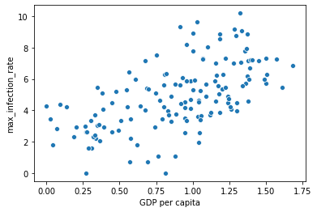


```python
sns.regplot(x,np.log(y))
```


    <AxesSubplot:xlabel='GDP per capita', ylabel='max_infection_rate'>


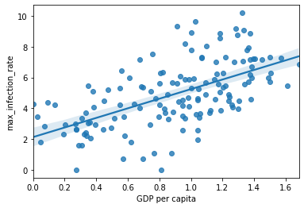


### Task 5.2: Plotting Social support vs maximum Infection rate


```python
x=data["Social support"]
y=data["max_infection_rate"]
sns.scatterplot(x,np.log(y))
```


    <AxesSubplot:xlabel='Social support', ylabel='max_infection_rate'>


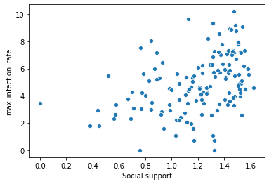


```python
sns.regplot(x,np.log(y))
```


    <AxesSubplot:xlabel='Social support', ylabel='max_infection_rate'>


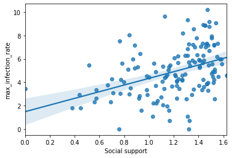


### Task 5.3: Plotting Healthy life expectancy vs maximum Infection rate


```python
x=data["Healthy life expectancy"]
x=data["max_infection_rate"]
sns.scatterplot(x,np.log(y))
```


    <AxesSubplot:xlabel='max_infection_rate', ylabel='max_infection_rate'>


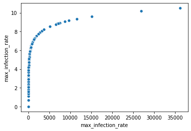


```python
sns.regplot(x,np.log(y))
```


    <AxesSubplot:xlabel='max_infection_rate', ylabel='max_infection_rate'>


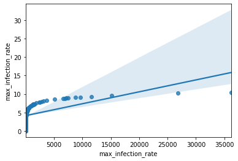


### Task 5.4: Plotting Freedom to make life choices vs maximum Infection rate


```python
x=data["Freedom to make life choices"]
y=data["max_infection_rate"]
sns.scatterplot(x,np.log(y))
```


    <AxesSubplot:xlabel='Freedom to make life choices', ylabel='max_infection_rate'>


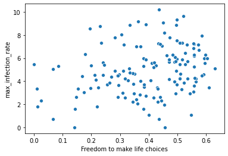


```python
sns.regplot(x,np.log(y))
```


    <AxesSubplot:xlabel='Freedom to make life choices', ylabel='max_infection_rate'>


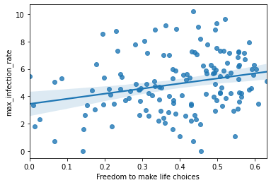

